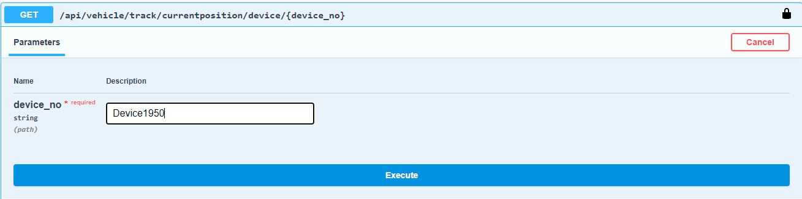

# Vehicle Tracking -  .NET Core | 5.0
This is an ASP.NET Core RESTful API solution with Clean Architecture, option to run on a docker container
****
### Technology Used :
<ul>
<li> Visual Studio 2019 16.8.2 or later</li>
<li>.Net Core SDK 5.0 </li>
<li>SQL Server</li>
<li>Rabbit MQ </li>
<li>Docker (optional)</li>
</ul>

### Building and running the app
We can run application either in docker or directly from Visual Studio. If we run it in docker then we don't require to install all dependency, docker-compose.yml file will run all dependency in docker container. </br></br>
When we run application in Visual studio then we require to install RabbitMQ. If you don't want to install RabbitMQ then you have to disable it in VehicleTracking.API appsettings.json. But installing RabbitMQ is recommended. It is using SQL Server express local db.
</br>

### 1. Running Application with Docker
Requirement : Docker Desktop should be installed on machine
1. Set RabbitMQ host name=> rabbitmq in appsettings.json for VehicleTracking.API and VehicleTracking.Services.RecordDevicePosition
```
"RabbitMQ": {
    "HostName": "rabbitmq",
    "Port": 5672,
    "UserName": "guest",
    "Password": "guest",
    "ConnectionTimeout": 1000,
    "Enabled": true
  }
```
Copy root folder path (where solution file is) in cmd and run docker-compose up command
```
C:\VehicleTracking> docker-compose up
```
It will pull application dependency from internet and start all containers. Wait until all dependencies are get installed and containers up.
Access http://localhost:7005/swagger/index.html in web browser

### 2. Run From Visual Studio
1. Install RabbitMQ on local machine
2. RabbitMQ should be enable in Appsettings.json and use localhost for host name in VehicleTracking.API and VehicleTracking.Services.RecordDevicePosition
```
"RabbitMQ": {
    "HostName": "localhost",
    "Port": 5672,
    "UserName": "guest",
    "Password": "guest",
    "ConnectionTimeout": 1000,
    "Enabled": true
  }
```
3. Press F5 to run application
4. Swagger API will be open
5. Start micro service VehicleTracking.Services.RecordDevicePosition(Right Click=>debug=>start new instance). If it get trouble in start then remove docker setting from launchSettings.Json

```
    "Docker": {
      "commandName": "Docker",
      "launchBrowser": true,
      "launchUrl": "{Scheme}://{ServiceHost}:{ServicePort}/swagger",
      "publishAllPorts": true,
      "useSSL": true
    }
```

***

### Functional Description: 
We have VehicleTracking.API that have all end points to be used by Admin and Device. There is a Micro Service which is use to record the device position. I used RabbitMQ to publish message from VehicleTracking.API to VehicleTracking.Services.RecordDevicePosition micro service.
</br></br>
In application we have 2 roles
### 1. Admin Role
>Admin can access end points for device list, device current position and device positions at certain time. I have added Admin user in database by migration. you can login by using userid <b>system</b> and password <b>system</b>. After successful login, it will generate a Bearer token in response.
use this access token to access all admin end points.


### 2. Device Role
>Device also has to login into system to record its position. When Device register/login itself then application will generate a bearer token and using this, device will be authorized to record its position in system.

Note : I have Added Swagger API document that have all details of end points, JSON Request and Response. but you can use any tools to call API end points.

***

### Map Integration:

I have integrated Bing Map to get device location based on latitude and longitude. Google Map API was asking to create billing account that's why I choose Microsoft. You have to create an [Api key](https://docs.microsoft.com/en-us/bingmaps/getting-started/bing-maps-dev-center-help/getting-a-bing-maps-key) and enable it from appsettings.json.

```
"MapProvider": {
    "URL": "http://dev.virtualearth.net/REST/v1/Locations/",
    "ApiKey": "",
    "Enabled" : true
  }
```

### Extensibility

If the customer wants to store more properties(fuel,speed, etc) how do we extend the data model to support it?

I assume extensibility for all device, every device want to store extra properties. For solution, I added extra properties in model and created migration, Also added these property only in dto, so with minimal changes application is able to support it.

If requirement is, some specific customer wants to record extra properties then I will adapt different design. I will create a Customer table and a CustomerType table. Each device will be linked with a customer and customer will be linked with customer type. I extend model/dto with new property for specific customer type. I will create a factory that will instantiate corresponding model based on customer type. We will pass device number, with device we get customer type and based on customer I will fill corresponding dto to show detail.


### Unit Test
I have added both functional and Unit test using NUnit Framework.

***

### Steps to Run End Points
#### Device Flow
Device End Points: </br>


1. Register Device : Enter DeviceNo, DeviceName and Passowrd

Note: DeviceNo is unique in system


We will get Access Token in Response


Authorize Device to record its position. Click on Authorize button on top in Swagger and Enter Bearer access_token


Note : If access token time is expired then login to get new token

2. Record Device Position


Request Accepted


3. Admin Log in : Enter userName : system and password: system


- We will get access token


Authorize Admin user to access all admin end points. Click on Authorize button on top in Swagger and Enter Bearer access_token

4. Get Device (Device1950) current location




5. Get Device positions at certain time


***


